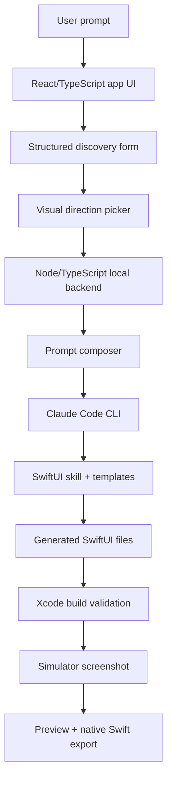
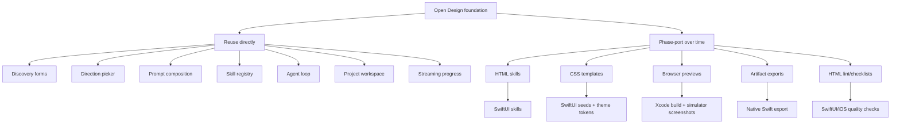
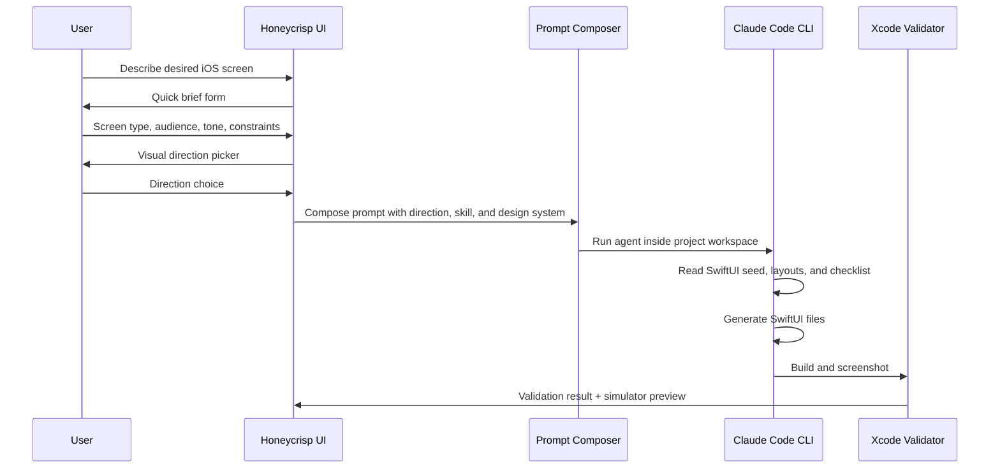
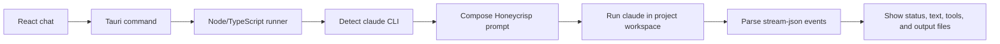

# Honeycrisp Architecture

Planning date: Wednesday, April 29, 2026
Latest research refresh: Monday, May 4, 2026

Honeycrisp is a planned Mac desktop app for generating polished native SwiftUI interfaces from plain-language prompts. The first focus is iOS mobile app screens. Later, the same architecture can expand to multi-screen flows, macOS apps, menu bar utilities, and broader native Apple platform work.

The main idea is simple:

> Reuse the design-generation loop from Open Design. Translate the output layer from HTML/browser artifacts into SwiftUI/Xcode artifacts.

## Product Shape

Honeycrisp is not meant to be a general export tool. It should do one thing very well: help an app developer quickly generate native SwiftUI UI that looks polished, compiles locally, and can be copied into a real Apple-platform project.

The first version should support:

- Prompt-driven iOS screen generation
- A structured discovery flow before generation
- A visual direction picker so the model does not freestyle every design
- SwiftUI source output
- Local Xcode validation
- Simulator screenshot preview
- A simple project workspace for generated files and iteration history

The product can be monetized later as a polished signed Mac app, open-core product, or local-first developer tool with optional paid features. That does not need to be solved before the architecture is sound.

## Stack

The planned stack keeps the app practical while still making the project resume-worthy.

| Layer             | Technology                           | Purpose                                                                                  |
| ----------------- | ------------------------------------ | ---------------------------------------------------------------------------------------- |
| Mac app container | Tauri                                | Packages the app as a lightweight native Mac desktop app                                 |
| User interface    | React + TypeScript                   | Builds the prompt UI, project browser, previews, forms, and settings                     |
| Local backend     | Node.js + TypeScript                 | Manages prompts, projects, Claude Code CLI execution, file output, and Xcode validation |
| Primary agent     | Claude Code CLI                      | Provides the mature code-agent loop, tool use, file editing, streaming, and session behavior |
| Native output     | Swift + SwiftUI                      | The generated code users actually want                                                   |
| Validation        | Xcode command line tools + Simulator | Builds generated SwiftUI and captures verified previews                                  |

Rust stays mostly inside Tauri unless the app later needs deeper native integrations. The main product logic should live in TypeScript so the system is easier to iterate on. Tauri should act as the Mac app bridge, not the place where the agent logic lives.

## High-Level System



The important boundary is that Honeycrisp is not just asking a model to return Swift in a chat message. The app should guide the model through a repeatable workflow, write real project files, validate those files, then show the user a preview that came from compiled native code.

## Open Design Reuse Strategy

Honeycrisp uses [Open Design](https://github.com/nexu-io/open-design) as the main architectural reference. Open Design has already solved many of the hard product problems around AI-assisted design generation:

- How to ask useful questions before generation
- How to bind a visual direction before the model starts designing
- How to load skills from `SKILL.md` files
- How to compose prompts from a base identity, active skill, design system, and user request
- How to stream agent progress back into the UI
- How to keep project files in a local workspace
- How to make the model self-check before showing a final artifact

Honeycrisp should reuse those ideas directly in spirit and structure.

What changes is the artifact target. Open Design primarily generates web artifacts such as HTML prototypes, decks, and browser previews. Honeycrisp should generate SwiftUI source files, validate them with Xcode, and export native Swift code.



The rule is:

> Reuse the loop. Translate the artifacts.

This avoids copying HTML-specific instructions into a SwiftUI product too early. Open Design's skills are valuable source material, but many of them are written around `index.html`, CSS variables, iframe preview behavior, and HTML exports. Honeycrisp should port those skills in phases by preserving their intent, workflow, archetypes, and quality standards while replacing the output contract.

## Agent Loop

Honeycrisp should keep Open Design's two-stage start because it is part of the quality system.



The loop should work like this:

1. The user describes the screen they want.
2. Honeycrisp asks a short structured brief.
3. Honeycrisp asks for or chooses a visual direction.
4. The backend composes the agent prompt from the user request, selected direction, active SwiftUI skill, and active design system.
5. The backend launches Claude Code CLI inside the generated project workspace.
6. Claude reads the skill seed files before writing code.
7. Claude writes SwiftUI files into the project workspace.
8. Honeycrisp validates the generated code with Xcode.
9. Honeycrisp shows the simulator screenshot and exportable source.

This is the part that prevents generic output. The app should not rely on one giant prompt. It should constrain the model before generation and check the result afterward.

## Primary Agent Runtime

Honeycrisp should use Claude Code CLI as the first real agent backend.

This is the closest match to Open Design's current architecture. Open Design delegates the hard agent loop to existing coding agents instead of rebuilding model calls, tool execution, file editing, permission handling, streaming, resume, and cancel behavior from scratch. For Honeycrisp, that means the first backend should detect the user's local `claude` command and run it against a Honeycrisp project workspace.

The first version should be intentionally small:



The important command shape is:

```txt
claude -p --output-format stream-json --verbose
```

The composed prompt should be sent through stdin, not as a huge command argument. Open Design does this to avoid command-length problems and to keep large prompts reliable.

Honeycrisp should use these Claude Code CLI ideas:

- Detect `claude` on the user's PATH
- Probe `claude --version` and `claude --help`
- Only pass optional flags when the installed CLI supports them
- Run Claude with the project workspace as the current working directory
- Send the composed Honeycrisp prompt through stdin
- Parse line-delimited `stream-json` output
- Map Claude events into Honeycrisp events like `status`, `agent`, `tool`, `tool_result`, `usage`, and later `file`
- Keep all generated files inside a local Honeycrisp project directory

For the first real implementation, Honeycrisp should keep Claude's tool access narrow. The app should let Claude read and edit the generated workspace, but Honeycrisp should own Xcode build commands itself. That keeps the agent focused on SwiftUI generation instead of letting it run arbitrary shell commands too early.

Later, Honeycrisp can add other engines behind the same event interface:

```txt
agent/
  engines/
    claudeCodeCliEngine.ts
    anthropicApiEngine.ts
    openAiApiEngine.ts
    codexCliEngine.ts
```

The default should stay Claude Code CLI first because it gives Honeycrisp a mature coding-agent loop immediately.

### Product Caveat

Claude Code CLI is excellent for a local developer tool, but Honeycrisp should be careful about product framing. The app should not pretend to provide Claude account access. Users should bring their own installed and authenticated `claude` CLI. Later, paid or distributed versions can add API-key based engines for users who do not have Claude Code installed.

## Skill Translation Layer

Open Design skills should become Honeycrisp SwiftUI skills over time.

| Open Design concept           | Honeycrisp equivalent                         |
| ----------------------------- | --------------------------------------------- |
| `SKILL.md`                    | `SKILL.md` with SwiftUI-specific workflow     |
| `assets/template.html`        | SwiftUI seed files and preview host templates |
| `references/layouts.md`       | SwiftUI screen archetypes                     |
| `references/checklist.md`     | Native iOS quality checklist                  |
| CSS `:root` variables         | Swift theme tokens                            |
| `<artifact type="text/html">` | `GeneratedUIManifest.json` + Swift files      |
| iframe preview                | Xcode build + Simulator screenshot            |

For example, Open Design's mobile app skill should not be copied directly into Honeycrisp. Its workflow is excellent, but its instructions are HTML-specific. The Honeycrisp version should preserve the idea of a high-quality mobile screen skill while replacing the output format:

- Keep: one screen, one job
- Keep: archetypes such as feed, detail, onboarding, profile, checkout, and focus
- Keep: real copy, strong hierarchy, restraint, and quality checklist
- Replace: HTML device frame with a real SwiftUI preview host
- Replace: CSS tokens with Swift design tokens
- Replace: HTML artifact handoff with Swift source files and a manifest

The long-term vision can include many translated skills, but the first implementation should prove the pattern with the closest match: a native SwiftUI iOS screen skill.

## Runtime Components

### Tauri Shell

Tauri packages the app as a Mac desktop application. It owns the window, menu integration, app permissions, and distribution surface.

### React/TypeScript UI

The React app is the interface the user clicks and types into. It should include:

- Prompt composer
- Project list
- Discovery forms
- Direction picker
- Agent progress stream
- File browser
- Build status
- Simulator screenshot preview
- Export controls

### Node/TypeScript Backend

The local backend is the core runtime. It should handle:

- Project workspace creation
- Skill loading
- Prompt composition
- Agent process management
- File read/write APIs
- Xcode build commands
- Simulator screenshot capture
- Export packaging

This is where most of Honeycrisp's app logic should live.

### SwiftUI Output

Generated output should be real SwiftUI, not a screenshot or web approximation. A generated project should include a small manifest and source files that can be opened, validated, and exported.

The first output contract can be simple:

```txt
GeneratedUI/
  GeneratedUIManifest.json
  Sources/
    GeneratedUI/
      GeneratedRootView.swift
      Theme.swift
      Components.swift
```

The manifest should describe the generated screen, target platform, entry point, source files, and validation result. The exact schema can evolve once implementation begins.

### Xcode Validation

Honeycrisp should validate generated SwiftUI locally before presenting it as successful. A generation should only be considered complete when:

- The agent changed generated source files
- The Swift files pass a basic static gate
- `xcodebuild` succeeds against a stable preview host
- The app or preview host launches in the Simulator
- A screenshot is captured and is not blank

This validation loop is a major product differentiator. The app should not just say "here is SwiftUI." It should say "this SwiftUI compiled and rendered."

## Research Provenance

This architecture was planned through an AI-assisted research process using GPT-5.5 extra-high reasoning in Codex, the Superpowers brainstorming workflow, parallel sub-agent repository analysis, and manual source verification.

The Open Design repository was inspected directly to understand its agent loop, prompt composition, skill registry, design-system handling, project workspace model, artifact flow, and quality-check process. The goal was not to blindly fork the repository, but to identify which parts of its design-generation architecture are reusable for Honeycrisp and which parts need to be translated from HTML/browser artifacts into native SwiftUI/Xcode artifacts.

The latest Open Design snapshot reviewed was commit `3b3275e` from Monday, May 4, 2026. Current Claude Code documentation was also checked for CLI flags, `stream-json` output, stdin-friendly print mode, authentication expectations, and the newer Claude Agent SDK option.

Key Open Design areas reviewed:

- `docs/agent-adapters.md` for the decision to delegate the full agent loop to local coding CLIs
- `apps/daemon/src/agents.ts` for Claude Code CLI detection, capability probing, argument building, model options, and stdin prompt delivery
- `apps/daemon/src/server.ts` for run creation, project workspace setup, prompt composition, process spawning, streaming, cancellation, and event forwarding
- `apps/daemon/src/claude-stream.ts` for parsing Claude Code `stream-json` output into UI-friendly events
- `apps/daemon/src/skills.ts` for skill discovery and skill-root preambles
- `apps/web/src/providers/daemon.ts` for translating daemon agent events into frontend event types
- `skills/mobile-app/SKILL.md` and related references for the mobile design workflow Honeycrisp should translate into SwiftUI

The resulting architecture separates reusable workflow concepts from output-specific implementation details:

- Reuse Open Design's loop, skill structure, prompt choreography, and local workspace model
- Phase-port HTML-specific skills into SwiftUI-native skills over time
- Replace browser preview and export behavior with Xcode validation, simulator screenshots, and native Swift source export

## Architecture Defaults

These are the current defaults for the first real build:

- Build a Mac desktop app, not a hosted website first
- Use Tauri for the shell
- Use React and TypeScript for the app UI
- Use Node and TypeScript for the local backend and agent runtime
- Use Claude Code CLI as the first real agent backend
- Generate SwiftUI for iOS first
- Validate locally with Xcode
- Start with prompt input only
- Start with one polished screen before expanding to multi-screen app flows
- Keep monetization out of the first technical milestone

These defaults can change later, but they are the clearest path to a working foundation.
