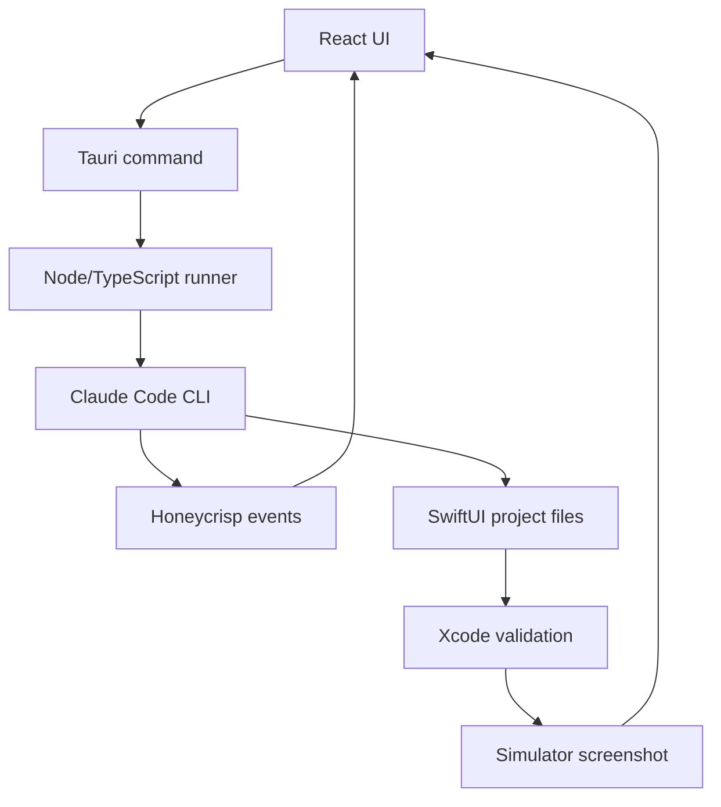
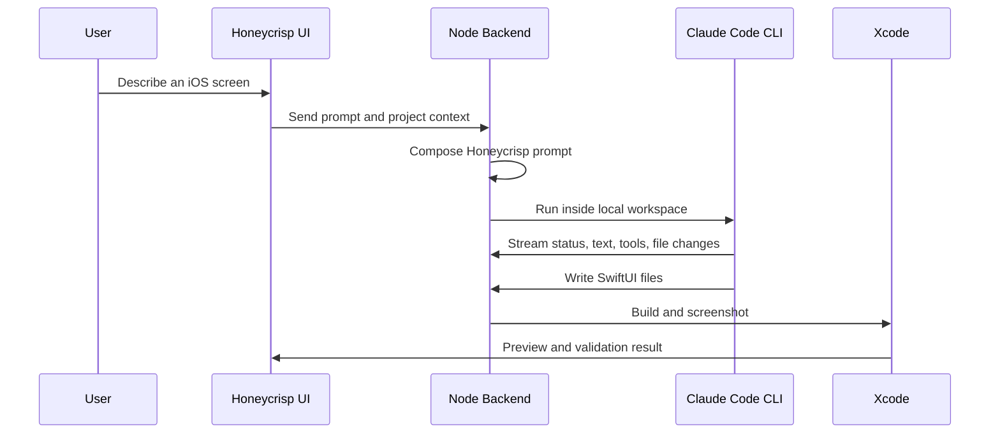

# Honeycrisp Architecture

Planning date: Wednesday, April 29, 2026
Latest refresh: Monday, May 4, 2026

Honeycrisp is a Mac desktop app for generating polished native SwiftUI interfaces from prompts. The first target is iOS mobile app screens. Later, the same foundation can expand to multi-screen flows, macOS apps, and menu bar utilities.

The core idea:

> Reuse Open Design's agent-guided design loop, but replace web exports with SwiftUI source, Xcode validation, and simulator screenshots.

## Product Focus

Honeycrisp is not a general export tool. It should do one thing well: help app developers generate native SwiftUI UI that looks polished, compiles locally, and can be copied into a real Apple-platform project.

The first useful loop is:

```txt
prompt -> Claude Code CLI -> SwiftUI files -> Xcode validation -> screenshot preview
```

## Stack

| Layer             | Technology                           | Purpose                                      |
| ----------------- | ------------------------------------ | -------------------------------------------- |
| Mac app shell     | Tauri                                | Lightweight desktop packaging and native OS bridge |
| Interface         | React + TypeScript                   | Chat rail, canvas, project UI, settings      |
| Local backend     | Node.js + TypeScript                 | Agent runtime, prompt composition, workspaces |
| Primary agent     | Claude Code CLI                      | Mature code-agent loop and file editing      |
| Output            | Swift + SwiftUI                      | Native code users actually want              |
| Validation        | Xcode command line tools + Simulator | Build generated code and capture previews    |

Rust should stay thin. Tauri owns desktop plumbing and IPC, while product logic stays in TypeScript.

## Current Checkpoint

Implemented:

- Tauri + React + TypeScript desktop scaffold
- Tailwind, shadcn/ui, Motion, Lucide, and canvas interaction libraries
- Custom Mac-style titlebar
- Resizable chat rail
- Infinite-canvas-style workspace surface
- Typed user, agent, status, and tool messages
- React-to-Tauri command bridge
- Tauri-to-Node runner bridge
- Claude Code CLI detection
- Claude Code CLI execution in `stream-json` mode
- Mapping Claude events into Honeycrisp UI events

Not implemented yet:

- Live event streaming from Claude into React
- Persistent Claude session across messages
- Local Honeycrisp project workspace
- SwiftUI skill files
- SwiftUI generation
- Xcode validation
- Simulator screenshot previews

The next milestone is replacing the current one-shot request/response bridge with a live event stream.

## System Flow



Honeycrisp should not ask a model to return Swift in a chat bubble and call that done. The app should guide the model, write real files, validate them locally, and show a preview from compiled native code.

## Open Design Strategy

[Open Design](https://github.com/nexu-io/open-design) is the main architecture reference. Honeycrisp should reuse the workflow ideas, not the HTML output layer.

Borrow:

- Discovery questions before generation
- Visual direction selection
- Skill-based prompt composition
- Local project workspace model
- Agent progress events
- Self-checking before final output

Translate:

- HTML skills -> SwiftUI skills
- CSS tokens -> Swift theme tokens
- Browser preview -> Xcode build and simulator screenshot
- HTML artifacts -> Swift source files and manifest
- Web export flow -> native Swift export flow

Rule:

> Reuse the loop. Translate the artifacts.

## Agent Loop

The desired flow is:



The quality system should come from structure, not one giant prompt. Honeycrisp should collect the user's intent, constrain the visual direction, load the right SwiftUI skill, run the agent in a workspace, and validate the result.

## Claude Code Runtime

Claude Code CLI is the first real backend because it already handles the hard parts of a coding-agent loop: file editing, tool use, streaming events, session behavior, and local authentication.

The important command shape is:

```txt
claude -p --output-format stream-json --verbose
```

Honeycrisp should:

- Detect `claude` on the user's PATH
- Probe `claude --version`
- Run Claude from the active project workspace
- Send the composed prompt through stdin
- Parse line-delimited `stream-json`
- Map Claude events into Honeycrisp events
- Keep generated files inside the Honeycrisp workspace

Users should bring their own installed and authenticated Claude Code CLI. Honeycrisp should not pretend to provide Claude account access.

Later, other engines can fit behind the same event interface:

```txt
agent/
  engines/
    claudeCodeCli.ts
    anthropicApi.ts
    openAiApi.ts
    codexCli.ts
```

## SwiftUI Output

Generated output should be real SwiftUI source. A first simple workspace can look like:

```txt
GeneratedUI/
  GeneratedUIManifest.json
  Sources/
    GeneratedUI/
      GeneratedRootView.swift
      Theme.swift
      Components.swift
```

The manifest should track the generated screen, platform target, entry point, source files, and validation result.

## Validation

A generation should only count as successful when:

- The agent changed generated Swift files
- Basic Swift source checks pass
- `xcodebuild` succeeds against a stable preview host
- The preview launches in Simulator
- The screenshot is captured and is not blank

This is the product differentiator: Honeycrisp should prove the SwiftUI compiles and renders.

## Defaults

Current architecture defaults:

- Build a Mac desktop app first
- Keep the app local-first
- Use Tauri only as the shell and bridge
- Keep agent/backend logic in TypeScript
- Use Claude Code CLI first
- Generate one polished iOS screen before expanding
- Validate with Xcode before showing success
- Keep monetization out of the first technical milestone

These defaults can change later, but they are the clearest path to a working foundation.
